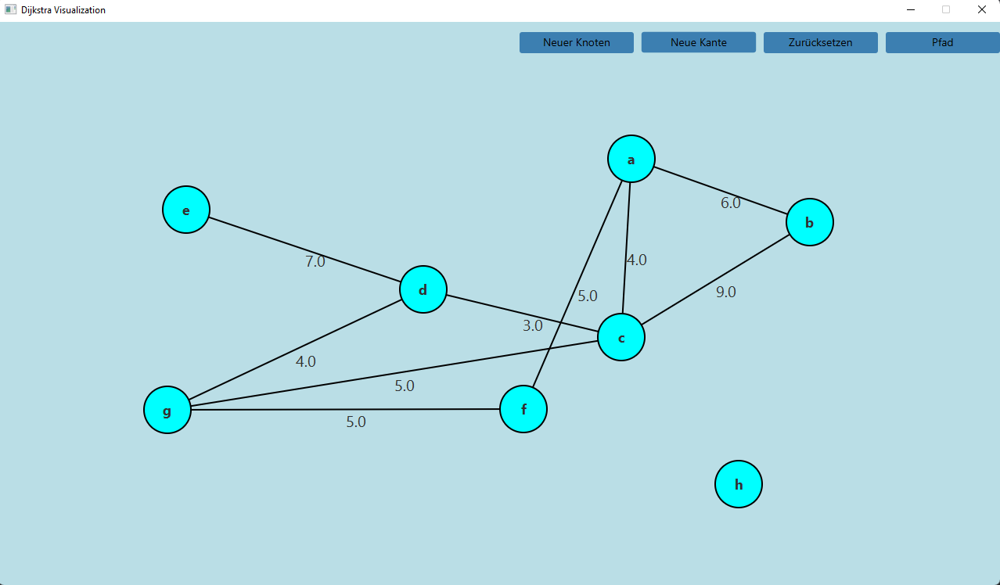
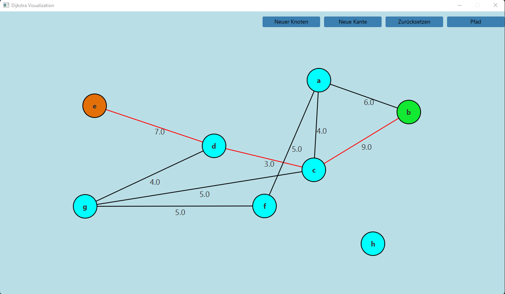

### Dijkstra Visualisierung
Dieses Projekt ist teil meiner Facharbeit über den Dijkstra Algorithmus.
Es berechnet den kürzesten Weg zwischen 2 Knoten auf einem Graphen mithilfe
des [Dijkstra-Algorithmus](https://de.wikipedia.org/wiki/Dijkstra-Algorithmus)
und stellt dies in einer grafischen Benutzeroberfläche dar.

### Ausführen des Programms
Das Programm wurde mit der JavaFX Bibliothek erstellt und mit Gradle gebaut. Zum Ausführen wird das 
[JDK 17](https://adoptium.net/?variant=openjdk17&jvmVariant=hotspot) benötigt.


Klone das Projekt. Dafür muss das Programm [git](https://git-scm.com/downloads) installiert sein.
```
git clone https://edugit.org/haddouam/dijkstrafacharbeit.git
```
Navigiere in den Projektordner
```
cd dijkstrafacharbeit
```
Führe das Projekt mit dem gradle wrapper aus
```
gradlew run
```
Daraufhin sollte sich das Programmfenster starten.

Alternativ kann auch die [Vorkompilierte Version](DijkstraFacharbeit.jar)
heruntergeladen und ausgeführt werden.

### Weitere Anmerkungen
Es wurden die Datenstrukturimplementationen der [Schulentwicklung NRW](https://www.schulentwicklung.nrw.de/lehrplaene/lehrplannavigator-s-ii/gymnasiale-oberstufe/informatik/hinweise-und-beispiele/hinweise-und-beispiele.html) benutzt

### Vorschau



### Klassendokumentation
Die HTML Javadocs können nach dem klonen durch das starten der Datei [documentation/index.html](documentation/index.html) 
im lokalen Webbrowser aufgerufen werden. Sie umfassen sowohl meine Implementation als auch die Klassen
der Schulentwicklung NRW, die genutzt wurden


